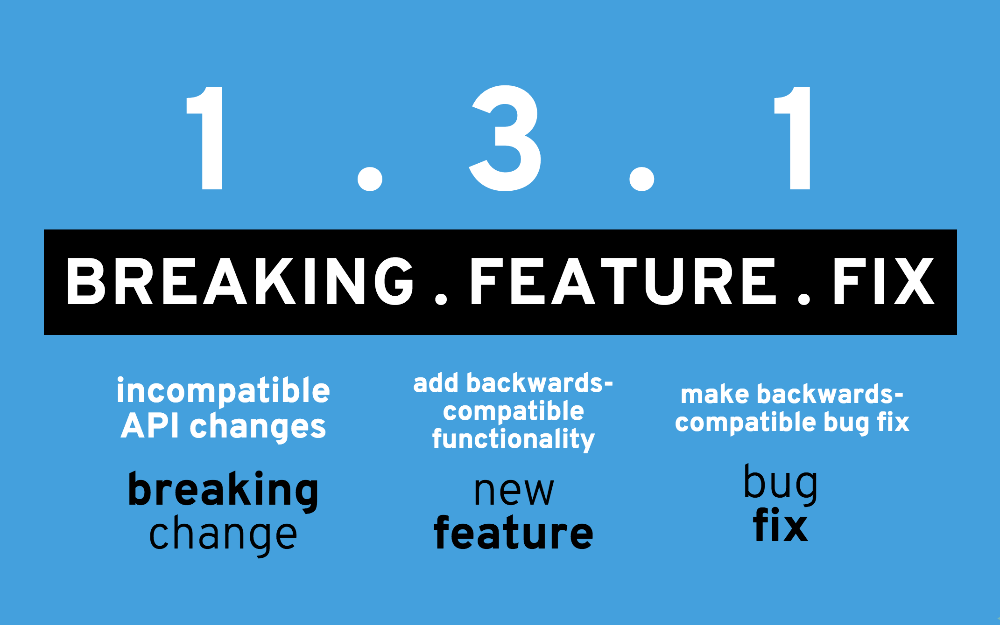

# coteafs-config

[][home]
[][circleci]
[][coverage]
[](https://sonarcloud.io/dashboard?id=com.github.wasiqb.coteafs%3Aconfigs)
[](https://sonarcloud.io/component_measures?id=com.github.wasiqb.coteafs%3Aconfigs&metric=Maintainability)
[](https://sonarcloud.io/component_measures?id=com.github.wasiqb.coteafs%3Aconfigs&metric=Reliability)
[](https://sonarcloud.io/component_measures?id=com.github.wasiqb.coteafs%3Aconfigs&metric=Security)
[](https://sonarcloud.io/component_measures?id=com.github.wasiqb.coteafs%3Aconfigs&metric=new_vulnerabilities)
[](https://sonarcloud.io/component_measures?id=com.github.wasiqb.coteafs%3Aconfigs&metric=Duplications)
[][maven]
[](https://github.com/WasiqB/coteafs-config/releases)
[](https://opensource.org/licenses/Apache-2.0)

## :boom: What's this all about?

This is a simple library to parse Config files of different formats into POJO's. It can directly be dropped into your Maven / Gradle projects and can be used in the project without any hassle.

## :golf: How to use?

To use this library, define your project specific config's POJO in whichever package as you may wish. Then define your POJO's fields using [lowerCaseNamingConvention](http://wiki.c2.com/?LowerCamelCase), and generate getter-setters for each field accordingly.

_**ServiceSetting.java**_

```java
public class ServiceSetting {
  private int port;
  private String type;
  private String  url;

  public int getPort () {
    return this.port;
  }

  public String getType () {
    return this.type;
  }

  public String getUrl () {
    return this.url;
  }

  public void setPort (final int port) {
    this.port = port;
  }

  public void setType (final String type) {
    this.type = type;
  }

  public void setUrl (final String url) {
    this.url = url;
  }
}
```

Once this is done, now you just need to define your POJO's corresponding config file for your project, as shown below:

### Yaml Config file

_**test-config.yaml**_

```yaml
url: http://localhost
port: 8080
type: SOAP
```

### JSON Config file

_**test-config.json**_

```json
{
  "api_url": "http://localhost",
  "api_port": 8080,
  "api_type": "SOAP"
}
```

### XML Config file

_**test-config.xml**_

```xml
<?xml version="1.0" encoding="UTF-8" ?>
<ServiceSetting>
  <api_url>http://localhost</api_url>
  <api_port>8080</api_port>
  <api_type>SOAP</api_type>
</ServiceSetting>
```

### Properties Config file

_**test-config.properties**_

```yaml
api_url = http://localhost
api_port = 8080
api_type = SOAP
```

Make sure that config keys are **lower_case_with_words_separated_with_underscore**.

The config file path can be provided in Environment variable with key `coteafs.config`, if it is not defined, then it will search System property with same key, if that is also not available then by default, it will search for file named `test-config.yaml` under `src/test/resources` directory.

You can define your own key by using `withKey` method of `ConfigLoader` class. You can also define default file name which can be found under resources folder using `withDefault` method.

### Example

```java
import static com.github.wasiqb.coteafs.config.loader.ConfigLoader.settings;
. . .
  ServiceSetting setting = settings ().withKey ("coteafs.xyz.setting")
    .withDefault ("test-config-xyz.json")
    .load (ServiceSetting.class);
. . .
```

## :pushpin: Usage?

You can use the following dependency into your `pom.xml` to use this library.

```xml
  <dependency>
    <groupId>com.github.wasiqb.coteafs</groupId>
    <artifactId>configs</artifactId>
    <version>2.0.0</version>
  </dependency>
```

Jar files can be directly downloaded from [Release](https://github.com/WasiqB/coteafs-config/releases) tab.

## :question: Need Assistance?

* Directly chat with me on my [site][] and I'll revert to you as soon as possible.
* Discuss your queries by writing to me @ wasbhamla2005@gmail.com
* If you find any issue which is bottleneck for you, [search the issue tracker][] to see if it is already raised.
* If not raised, then you can create a [new issue][] with required details as mentioned in the issue template.

## :star: What you do if you like the project?

* Spread the word with your network.
* **Star** the project to make the project popular.
* Stay updated with the project progress by **Watching** it.
* Contribute to fix open issues, documentations or add new features. To know more, see our [contributing][] page.
* I would be delighted if you can **Sponsor** this project and provide your support to open source development by clicking on the **Sponsor button** on the top of this repository.

## :heavy_check_mark: Contributors

<div>
  <ul>
    <li>
      <a href="https://github.com/WasiqB">
        
      </a>
    </li>
    <li>
      <a href="https://github.com/mfaisalkhatri">
        
      </a>
    </li>
  </ul>
</div>

## :ticket: Versioning ideology

<p align="left">
  <a href="http://semver.org/">
    
  </a>
</p>

## :copyright:Wasiq Bhamla

<p align="left">
  <a href="http://www.apache.org/licenses/LICENSE-2.0">
    
  </a>
</p>

[site]: https://wasiqb.github.io
[search the issue tracker]: https://github.com/WasiqB/coteafs-config/issues?q=something
[new issue]: https://github.com/WasiqB/coteafs-config/issues/new
[contributing]: .github/CONTRIBUTING.md
[home]: https://github.com/wasiqb/coteafs-config
[circleci]: https://circleci.com/gh/WasiqB/coteafs-config
[coverage]: https://sonarcloud.io/component_measures?id=com.github.wasiqb.coteafs%3Aconfigs&metric=Coverage
[maven]: https://maven-badges.herokuapp.com/maven-central/com.github.wasiqb.coteafs/configs
